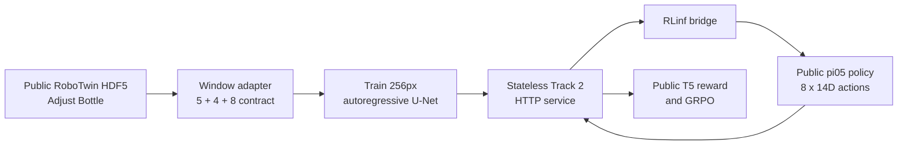
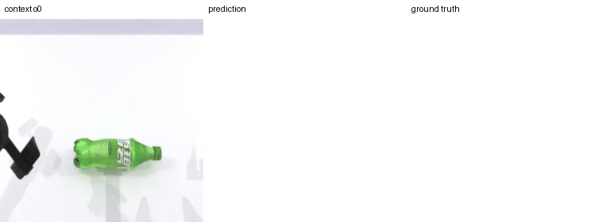
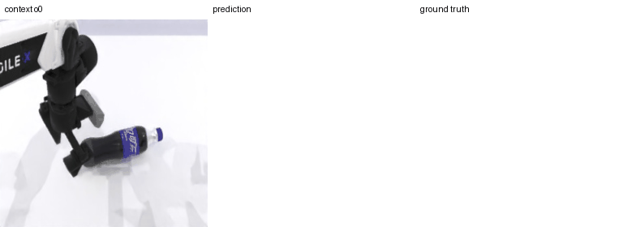

# IROS World Model Challenge 2.0 - Track 2

<p align="center">
  <strong>Action-conditioned world model for RoboTwin Adjust Bottle</strong><br />
  <sub>WorldArena 2.0 Track 2 | 5 RGB frames + 4 action history + 8 future actions -> 8 predicted RGB frames</sub>
</p>

<p align="center">
  <a href="#baseline">Baseline</a> |
  <a href="#visual-results">Visual Results</a> |
  <a href="#quick-start">Quick Start</a> |
  <a href="#evaluation-boundary">Evaluation Boundary</a> |
  <a href="#roadmap">Roadmap</a>
</p>

## Status

| Item | Status |
| --- | --- |
| Track 2 API contract | Passed locally |
| Native-resolution baseline | Motion-gated autoregressive/Direct Flow ensemble |
| Episode-disjoint open-loop evaluation | Complete |
| Multi-round sliding-window rollout | Complete |
| Best reproducible world-model candidate | Motion-gated two-small-model backend; strict gate not passed |
| Public pi05 + T5 reward + RLinf/GRPO | Historical integration smoke only; paused pending strict prediction acceptance |
| Official hidden evaluation | Not publicly available |

This repository contains deterministic Track 2 baselines and a reproducible
motion-gated candidate for the public Adjust Bottle fine-tuning data. The active candidate
may enter RL only after every one of the `682 x 8` held-out prediction frames has
RGB MAE below `1/255`. Track 2 fixes the API and closed-loop evaluation protocol,
not the world-model architecture; Wan2.2 is an official RLinf reference model,
not a mandatory submission requirement.

## Pipeline



Every prediction request follows the published Track 2 profile:

```text
o0 o1 o2 o3 o4 + a0 a1 a2 a3 + u0 u1 u2 u3 u4 u5 u6 u7
                         |
                         v
                    p0 p1 p2 p3 p4 p5 p6 p7

a_i: o_i -> o_(i+1)       u0: o4 -> p0       u_j: p_(j-1) -> p_j
```

| Field | Shape | Type | Meaning |
| --- | --- | --- | --- |
| Context frames | `[5, 256, 256, 3]` | RGB `uint8` | Oldest to newest observations |
| History actions | `[4, 14]` | `float32` | Actions producing the context transitions |
| Future actions | `[8, 14]` | `float32` | Policy action chunk to simulate |
| Predicted frames | `[8, 256, 256, 3]` | RGB `uint8` | One frame aligned with every future action |

The next closed-loop request uses the latest five generated frames and the last
four actions as new context. The service itself is stateless: every
`/v1/predict` call includes all context required to make a prediction.

## Baseline

```text
backend:       autoregressive-flow-ensemble
model version: autoregressive-horizon-largebatch-direct-flow-motion-gated-v3
checkpoint:    artifacts/checkpoints/autoregressive-horizon-largebatch-direct-flow-motion-gated-v3
resolution:    256 x 256 RGB
gate:          high observed motion -> autoregressive; low motion -> 50/50 Direct Flow blend
```

The fixed split is episode-disjoint: 40 training episodes, 5 validation
episodes, and 5 local-test episodes. The candidate trains on full eight-step
recursive rollouts rather than only one-step teacher-forced targets.

| Public-data split | Windows | Candidate MAE (RGB 0-255) | Copy-last MAE | Improvement |
| --- | ---: | ---: | ---: | ---: |
| Validation | 682 | **6.064** | 15.334 | **60.5% lower** |
| Local test | 667 | **5.197** | 15.108 | **65.6% lower** |

Reports: [validation JSON](artifacts/evaluations/autoregressive_horizon_largebatch_direct_flow_motion_gate_validation_all.json) and [local-test JSON](artifacts/evaluations/autoregressive_horizon_largebatch_direct_flow_motion_gate_local_test_all.json). Horizon-weighted and batch-8 refinement reduce the motion-autoregressive parent by 8.19% on validation and 8.24% on local-test. The observable-motion gate contributes another 0.64% and 0.79%, without regressing high-motion MAE. It still fails the required all-eight-frame `1/255` gate.

## Visual Results

Each GIF shows `prediction | ground truth` for every future step after the
five-frame context. Both examples are held-out episodes; neither was used for
training.

<p align="center">
  
  
</p>

<p align="center">
  <sub>Left: validation episode 16 (continuous motion). Right: local-test episode 2 (decelerating motion).</sub>
</p>

The local-test example appears sharper because its later motion slows down; it
is not evidence of memorization or a better-than-baseline result for that
single window. Continuous robot-arm and bottle motion is the key remaining
modeling challenge.

## Quick Start

### 1. Environment and tests

```bash
conda run -n go1 python pipeline/scripts/check_environment.py
conda run -n go1 pip install -r pipeline/requirements-go1.txt

export PYTHONPATH="$PWD/pipeline"
conda run -n go1 pytest -q pipeline/tests
```

Expected result: `36 passed`.

### 2. Verify and adapt public data

Download the published `aloha-agilex_clean_50` dataset, then run:

```bash
export PYTHONPATH="$PWD/pipeline"

conda run -n go1 python pipeline/scripts/verify_robotwin_data.py \
  --input artifacts/datasets/aloha-agilex_clean_50/data

conda run -n go1 python pipeline/scripts/adapt_robotwin.py \
  --input artifacts/datasets/aloha-agilex_clean_50/data \
  --output artifacts/adjust_bottle_windows_full

conda run -n go1 python pipeline/scripts/make_episode_split.py \
  --windows artifacts/adjust_bottle_windows_full \
  --output artifacts/splits/adjust_bottle_50episodes_full.json
```

### 3. Rebuild the autoregressive candidate

```bash
bash pipeline/scripts/run_autoregressive_rebuild.sh
bash pipeline/scripts/run_autoregressive_motion_rebuild_pilot.sh
bash pipeline/scripts/run_autoregressive_horizon_pilot.sh
bash pipeline/scripts/run_autoregressive_horizon_largebatch_refine.sh
```

The launcher reconstructs the one-step and rollout-8 stages, resumes atomically
after interruption, runs the paired 64-window promotion check, and performs the
full 682-window evaluation only when the pilot improves by at least 1%. The
second launcher applies motion-aware fine-tuning and runs local-test only after
its independent pilot and full-validation gates pass. The third launcher gives
later rollout horizons more loss weight while keeping the mean loss scale fixed.

After the cross-validated motion-gate report promotes, create the deployable
two-small-model package:

```bash
conda run -n go1 python pipeline/scripts/package_autoregressive_flow_motion_gate.py \
  --autoregressive-checkpoint artifacts/checkpoints/autoregressive-unet-track2-rollout8-horizon-largebatch-refine-v1/best \
  --direct-flow-checkpoint artifacts/checkpoints/direct-flow-unet-track2-formal-v2/best \
  --selection-report artifacts/evaluations/autoregressive_horizon_largebatch_refine_direct_flow_motion_gate_full682.json \
  --output artifacts/checkpoints/autoregressive-horizon-largebatch-direct-flow-motion-gated-v3
```

### 4. Start the service and run the API contract test

Terminal A:

```bash
WAM_BACKEND=autoregressive-flow-ensemble \
WAM_CHECKPOINT_DIR=artifacts/checkpoints/autoregressive-horizon-largebatch-direct-flow-motion-gated-v3 \
WAM_MODEL_VERSION=autoregressive-horizon-largebatch-direct-flow-motion-gated-v3 \
WAM_BEARER_TOKEN=local-dev-token WAM_PORT=8001 \
conda run -n go1 python pipeline/scripts/serve.py
```

Terminal B:

```bash
export PYTHONPATH="$PWD/pipeline"
conda run -n go1 python pipeline/scripts/contract_test.py \
  --base-url http://127.0.0.1:8001 \
  --token local-dev-token \
  --model-version autoregressive-horizon-largebatch-direct-flow-motion-gated-v3
```

The contract test covers health, capabilities, one- and eight-sample batches,
deterministic retry, request-ID conflict, invalid payloads, profile validation,
and authentication.

## Public RLinf Closed Loop

The local integration uses the published pi05 policy, T5 reward checkpoint, and
RLinf/GRPO stack. The bridge turns every RLinf action chunk into one Track 2
API request:

```text
public reset -> pi05 (8 x 14D actions) -> /v1/predict (8 frames)
             -> public T5 reward (8 values) -> GRPO update
```

```bash
export PYTHONPATH="$PWD/pipeline"

conda run -n go1 python pipeline/scripts/make_public_rlinf_reset_dataset.py \
  --input artifacts/datasets/aloha-agilex_clean_50 \
  --output artifacts/rlinf_public_reset_adjust_bottle

conda run -n go1 bash pipeline/scripts/run_public_rlinf_track2.sh \
  runner.max_steps=1
```

Before the RLinf command, download the published policy/reward resources, start
the accepted model service, and start `wam_pipeline.rlinf_bridge.server`. Set
`WAM_CHECKPOINT_DIR`, `WAM_BACKEND=autoregressive-flow-ensemble`, and
`WAM_STRICT_EVALUATION` to the full `682 x 8` evaluation JSON; the RLinf command
rejects missing, partial, stale, or failing evidence. Full commands are in
[the concise SOP](快速跑通官方pipeline.md).

## Evaluation Boundary

| Claim | Status |
| --- | --- |
| API/profile compliance in local tests | Verified |
| Open-loop prediction on public held-out episodes | Verified |
| Public local pi05/reward/RLinf integration | Verified |
| Official closed-loop score on hidden reset states | Unknown until organizer evaluation |
| Transfer return in the independent hidden environment | Unknown until organizer evaluation |

The competition ranks downstream closed-loop policy utility, not standalone MAE
or visual quality. Public MAE and GIFs are development diagnostics only; they
are not official scores.

## Repository Layout

```text
.
├── README.md                         # Project overview and entry points
├── 快速跑通官方pipeline.md            # Concise Chinese SOP
├── 赛道2_世界模型赛道完整说明.md       # Track rules and submission notes
├── pipeline/
│   ├── wam_pipeline/                 # API, backends, data contract, RLinf bridge
│   ├── scripts/                      # Data, training, evaluation, serving tools
│   ├── tests/                        # API and temporal-window tests
│   └── README.md                     # Detailed engineering reference
└── artifacts/
    ├── evaluations/                  # Versioned public-data reports
    └── visualizations/               # Current candidate GIF comparisons
```

Datasets, downloaded official resources, checkpoints, logs, and intermediate
artifacts are excluded from Git. Obtain them from published sources or
regenerate them with the included scripts.

## Roadmap

1. Improve sustained bottle and robot-arm motion with motion-aware sampling,
   losses, and longer closed-loop validation.
2. After the formal model passes the `682 x 8` gate, run it through multi-step
   public RLinf on a dedicated API/bridge port and record policy-return stability.
3. Run Wan2.2/DiffSynth as a reference baseline when GPU capacity permits, then
   compare both models under the same API and RLinf protocol.
4. Freeze the best model version, package the service, rerun contract and
   reproducibility checks, and submit the immutable final service.

## Documentation

- [Concise local SOP](快速跑通官方pipeline.md)
- [Detailed engineering pipeline](pipeline/README.md)
- [Track 2 competition notes](赛道2_世界模型赛道完整说明.md)
- [Official Track 2 API](https://github.com/WorldArena2/WorldArena-2.0/blob/main/assets/track2_world_model_service_api_en.md)
- [Official Track 2 description](https://github.com/WorldArena2/WorldArena-2.0/blob/main/assets/track2_benchmark_description_en.md)

## License and Data

This repository contains project code and documentation only. Every external
model, dataset, policy, reward checkpoint, and third-party dependency remains
subject to its original license and the WorldArena competition rules.
